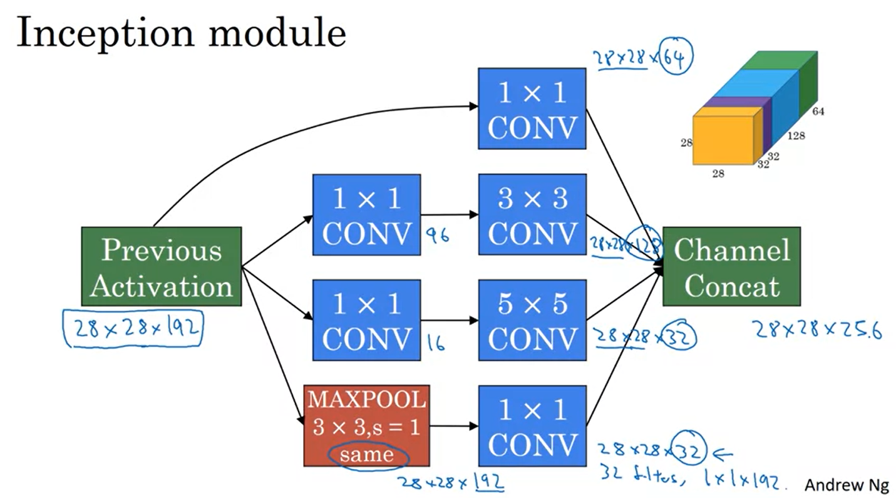
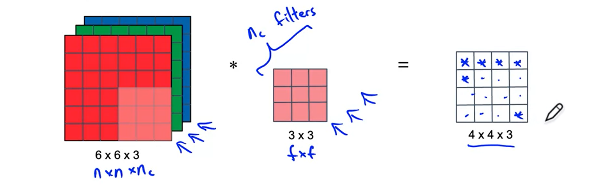

# Convolutional Neural Networks

Implement the foundational layers of CNNs (pooling, convolutions) and stack them properly in a deep network to solve multi-class image classification problems.

## Learning Objectives

* Explain the convolution operation
* Apply two different types of pooling operations
* Identify the components used in a convolutional neural network (padding, stride, filter, ...) and their purpose
* Build a convolutional neural network
* Implement convolutional and pooling layers in numpy, including forward propagation
* Implement helper functions to use when implementing a TensorFlow model
* Create a mood classifer using the TF Keras Sequential API
* Build a ConvNet to identify sign language digits using the TF Keras Functional API
* Build and train a ConvNet in TensorFlow for a binary classification problem
* Build and train a ConvNet in TensorFlow for a multiclass classification problem
* Explain different use cases for the Sequential and Functional APIs

## Computer Vision Problems

## Vertical Edge Detection

## Vertical Edget

## Learning to detect edgets

## Get Specific Edgets 

## Padding Image

## Valid And Same Convolutions
Valid: 
* nxn * fxf -> n-f+1  x n-f+1 
* 6x6 * 3x3 -> 4x4

## Strided Convolution

## Strided Formula 

## Summary Of Convoultion

## Technical Note On Cross-correlation vs. Convolution

## Convolution In Math Textbook

## Convolutions On RGB Images

## Multiple Filters

## Example Of A Layer

## Exercise

## Summary Of Convolution

## Pooling Layer: Max pooling

## Summary of MaxPooling

## Number of Parameters

Here are the 5 typos:

1. 208 should be (5*5*3 + 1) * 8 = 608
2. 416 should be (5*5*8 + 1) * 16 = 3216
3.  In the FC3, 48001 should be 400*120 + 120 = 48120, since the bias should have 120 parameters, not 1
4.  Similarly, in the FC4, 10081 should be 120*84 + 84 (not 1) = 10164

(Here, the bias is for the fully connected layer.  In fully connected layers, there will be one bias for each neuron, so the bias become In FC3 there were 120 neurons so 120 biases.)

5. Finally, in the softmax, 841 should be 84*10 + 10 = 850

## Why Use Convolution

This is based on the equation:

## Outline

## LeNet-5

## AlexNext

## VGG-16

## Residual block

## Residual Network

## The Problem of computational cost

## 1X1 Convolution

## Inception Module

## Inception Network

## Origin Inception

[https://knowyourmeme.com/memes/we-need-to-go-deeper](https://knowyourmeme.com/memes/we-need-to-go-deeper)

## Mobile Net

## Common Augmentation Method

### 1. Mirroring

### 2. Random Cropping

### 3. Color Shifting

## Implementing Distortions During Training

## Object Localization

### Defining the target label y

